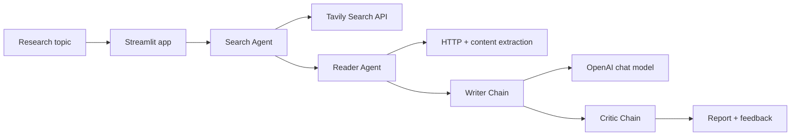

# LangChain Multi-Agent Research System

An AI-assisted research application that combines web search, web page extraction,
report writing, and critical review into a single workflow. The Streamlit interface
lets you enter a topic and watch four specialized LangChain components produce a
structured research report.

## Features

- Search recent web content with Tavily.
- Select and scrape a relevant source for deeper context.
- Generate a structured report with an OpenAI chat model.
- Review the generated report with a separate critic chain and score.
- Inspect intermediate search and scraping results in the UI.
- Download the final report as a Markdown file.

## Architecture

The application uses a sequential pipeline. The search and reader agents are
tool-using LangChain agents; the writer and critic are prompt-based LangChain
chains.



### Pipeline stages

1. **Search Agent** finds recent sources using the Tavily search tool.
2. **Reader Agent** chooses a relevant URL and extracts readable page content.
3. **Writer Chain** combines the search results and extracted content into a
	 report with an introduction, findings, conclusion, and sources.
4. **Critic Chain** evaluates the report and returns a score, strengths, areas
	 to improve, and a one-line verdict.

## Technologies

- **Python 3.11**
- **Streamlit** for the interactive web UI
- **LangChain** and **LangChain Core** for agents, prompts, and chains
- **OpenAI** through `langchain-openai` for report generation and critique
- **Tavily** for web search
- **Requests**, **Trafilatura**, **Readability**, and **BeautifulSoup** for
	web retrieval and content extraction
- **python-dotenv** for local environment configuration
- **Rich** for console output formatting

## Requirements

- Python 3.11 or newer
- An OpenAI API key
- A Tavily API key
- Internet access for model requests, search, and page retrieval

## Installation

### Using Conda

```bash
conda create -n langagent python=3.11 -y
conda activate langagent
pip install -r requirements.txt
```

### Using a Python virtual environment

```bash
python -m venv .venv
```

Activate it with the command for your platform:

```bash
# Windows PowerShell
.\.venv\Scripts\Activate.ps1

# macOS/Linux
source .venv/bin/activate
```

Then install the dependencies:

```bash
python -m pip install -r requirements.txt
```

## Configuration

Create a `.env` file in the project root. Do not commit this file or expose the
keys in source control.

```dotenv
OPENAI_API_KEY=your_openai_api_key
TAVILY_API_KEY=your_tavily_api_key
```

The application currently uses the `gpt-4o-mini` model. Model selection and
temperature are configured in `src/agents/agents.py`.

## Running the application

Start the Streamlit interface from the project root:

```bash
streamlit run app.py
```

Open the local URL printed by Streamlit, enter a research topic, and select
**Run Research Pipeline**. The interface displays each stage's progress and
provides a Markdown download when the report is complete.

### Running the pipeline from Python

`main.py` also demonstrates calling the pipeline directly:

```bash
python main.py
```

To use the pipeline from another Python module:

```python
from src.pipelines.pipeline import run_research_pipeline

result = run_research_pipeline("Impact of AI on the 2026 job market")
print(result["report"])
print(result["feedback"])
```

## Project structure

```text
.
├── app.py                    # Streamlit user interface
├── main.py                   # Direct pipeline example
├── requirements.txt          # Python dependencies
└── src/
		├── agents/agents.py      # Search/reader agents and writer/critic chains
		├── pipelines/pipeline.py # Sequential research orchestration
		└── tools/tools.py        # Tavily search and URL extraction tools
```

## Notes and limitations

- Search and generated content depend on the availability and quality of the
	configured APIs and source websites.
- Web pages may block automated requests or return content that cannot be
	extracted cleanly.
- The generated report should be checked against the original sources before it
	is used for high-stakes decisions.
- API usage may incur charges according to the OpenAI and Tavily accounts.

## Contributing

Contributions are welcome. For a change, please open an issue describing the
problem or proposal, keep the implementation focused, and include any relevant
validation steps in the pull request.

## License

This project is distributed under the license in [LICENSE](LICENSE).